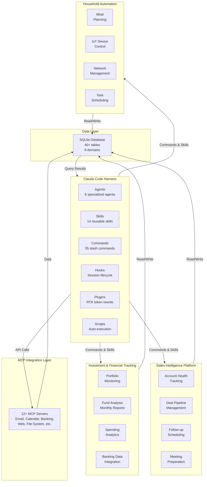
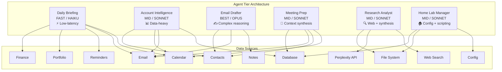
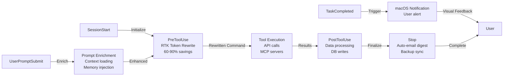
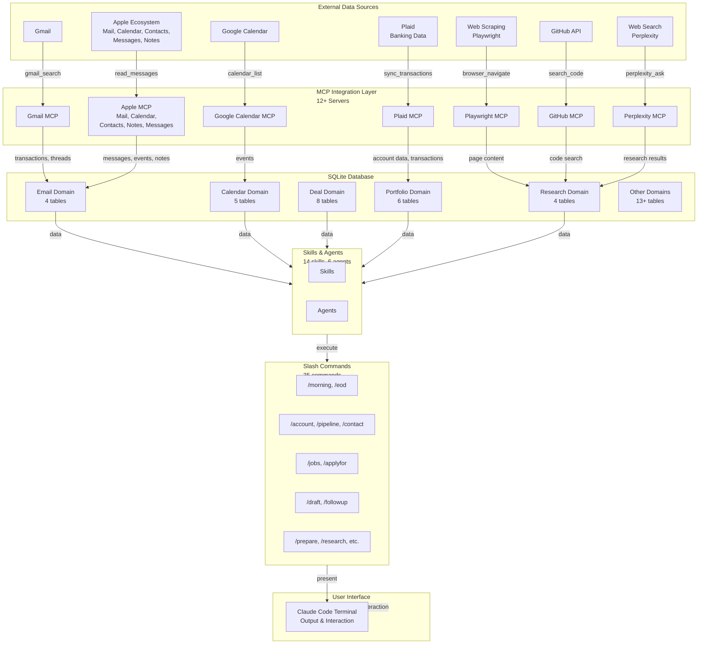
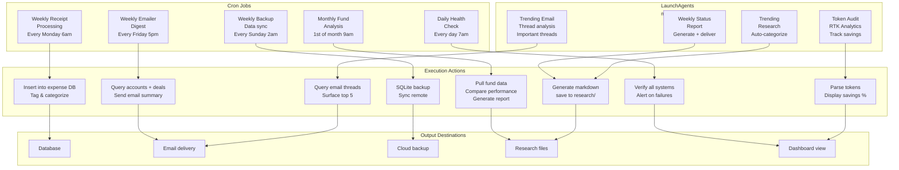

# Claude Code Personal Automation Platform - System Architecture

## Diagram 1: High-Level System Architecture

---

## Diagram 2: Agent Architecture

---

## Diagram 3: Hook Pipeline

---

## Diagram 4: Data Flow Architecture

---

## Diagram 5: Scheduled Automation

---

## Architecture Notes

### System Pillars
- **Claude Code Harness**: Core automation runtime with agents, skills, commands, hooks, plugins, and scripts
- **Sales Intelligence**: Account tracking, deal management, follow-ups, and meeting preparation
- **Investment & Financial Tracking**: Portfolio monitoring, fund analysis, spending analytics, and banking integration
- **Household Automation**: Meal planning, IoT control, network management, and task scheduling

### Data Organization
- **SQLite Database**: 40+ tables across 9 domains (Email, Calendar, Deals, Portfolio, Research, and others)
- **MCP Servers**: 12+ integration points for cloud services and local system access

### Agent Tier Strategy
- **HAIKU (Fast)**: Simple, low-latency briefings with strict context limits
- **SONNET (Mid)**: Standard complexity tasks with balanced cost/capability
- **OPUS (Best)**: Complex reasoning tasks requiring maximum accuracy (email drafting)

### Automation Scope
- **Cron jobs**: 5 recurring system tasks running on fixed schedules
- **LaunchAgents**: 4 native macOS scheduled processes for background work
- **Hook-driven events**: Real-time processing on prompt submission, tool execution, and session lifecycle

